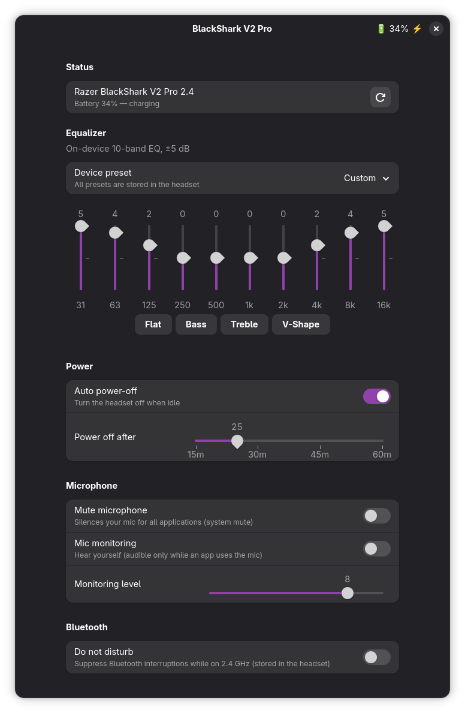

# BlackShark V2 Pro GUI

A small one-file GTK4/libadwaita app to control the **Razer BlackShark V2 Pro 2.4** wireless
headset (USB `1532:0555`) on Linux, talking to the OpenRazer daemon.

<p align="center"></p>

## Features

- Battery level and charging state (live, in the header bar)
- 10-band equalizer (±5 dB), applied by the headset's own DSP — all presets and curves live
  **in the headset**, so they keep working standalone (console, other PC)
  - Device presets: Game / Music / Movie (fixed curves in headset ROM), five game EQs and Custom
    (each with its own stored, editable-by-Synapse curve slot on the device)
  - Selecting a game EQ shows its curve read live from the headset (read-only sliders)
  - The preset selector follows the headset's EQ button in both directions
  - Quick curve buttons (Flat / Bass / Treble / V-Shape) for the custom preset
- Auto power-off timer (off / 15–60 minutes, by-minute slider)
- Microphone: system mute toggle, mic monitoring (sidetone) on/off and level 0–10
- Bluetooth "Do Not Disturb" toggle (dual-mode 2.4 GHz + Bluetooth)
- Auto-reconnect when the headset is plugged in / powered on

## Requirements

| Dependency | Notes |
|---|---|
| **OpenRazer** — BlackShark V2 Pro full-hardware-support branch | The stock OpenRazer release does **not** support this headset yet. Install driver, daemon and Python library from the feature branch (`add-blackshark-v2-pro-2.4`) and make sure the `openrazer-daemon` user service is running and your user is in the `plugdev` group. |
| Python 3 with GTK4 + libadwaita bindings | Fedora: `python3-gobject gtk4 libadwaita` · Debian/Ubuntu: `python3-gi gir1.2-gtk-4.0 gir1.2-adw-1` · Arch: `python-gobject gtk4 libadwaita` |
| `pactl` (PipeWire or PulseAudio) | Only needed for the system mic-mute toggle; everything else works without it. |

## Install

```sh
./install.sh
```

Installs per-user (no root): the app goes to `~/.local/bin/blackshark-gui` and a desktop entry to
`~/.local/share/applications/`, so "BlackShark V2 Pro" shows up in your application menu. The
script checks the dependencies first and tells you what is missing.

## Uninstall

```sh
./uninstall.sh
```

Removes the app and the desktop entry.

## Troubleshooting

- **"Headset not found"** — is the `openrazer-daemon` user service running
  (`systemctl --user status openrazer-daemon`)? Is your user in the `plugdev` group? Is the 2.4 GHz
  dongle plugged in and the headset powered on?
- **Still not found after reinstalling/updating the OpenRazer driver** — restart the GUI (the
  daemon restart drops its connection); if that is not enough, replug the dongle.
- **Mic monitoring is silent** — device behaviour: the sidetone is only audible while an
  application actually uses the microphone (e.g. a voice call).
- **Game/Music/Movie show no EQ sliders** — their curves are stored in headset ROM and cannot be
  read out; the sliders are shown for the game EQs (curves read live from the headset) and Custom
  (editable).
- **Short "blip" of the old custom curve when jumping from another preset straight to a custom
  curve** (e.g. Movie → the V-Shape button) — headset behaviour: entering the custom preset first
  re-activates its previously stored curve; the new curve is stored and takes over right after.
  Changes while already on Custom apply in one step.

## License

GPL-2.0-or-later (see `LICENSE`) — the app links against OpenRazer's GPL-licensed Python library.
